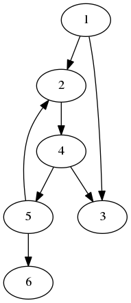

```c++
/*
Copyright 2018 Pierre-Edouard Portier
peportier.me

Licensed under the Apache License, Version 2.0 (the "License");
you may not use this file except in compliance with the License.
You may obtain a copy of the License at

    http://www.apache.org/licenses/LICENSE-2.0

Unless required by applicable law or agreed to in writing, software
distributed under the License is distributed on an "AS IS" BASIS,
WITHOUT WARRANTIES OR CONDITIONS OF ANY KIND, either express or implied.
See the License for the specific language governing permissions and
limitations under the License.
)
*/

```
# Parcours de graphe, algorithme générique

Répertoire GitHub correspondant à cet article : https://github.com/peportier/ia-parcours

## Dérivation du programme à partir de sa spécification
### Première esquisse
Étant donné un graphe orienté $G$ et un nœud $v$ de ce graphe, nous cherchons à calculer l'ensemble des nœuds atteignables à partir de $v$.

Nous notons $s$ la fonction "successeur" qui retourne les voisins directs d'un
ensemble de nœuds.

Nous définissons la fonction $a​$ ("atteignable") :

$$a(x) = x \cup a(s(x))​$$

L'ensemble $u​$ des nœuds atteignables à partir de $x​$ possède la propriété :
$$a(u) = u​$$
En particulier, $s(u) \subseteq u  \quad \Rightarrow \quad a(u) = u​$.

L'ensemble des nœuds atteignables à partir de l'ensemble de nœuds $x$ est le plus petit ensemble qui inclut $x$ et qui possède la propriété ci-dessus. Sans cette précision, cette propriété ne permet pas de définir $a$. Par exemple, quelque soit $x$, l'ensemble de tous les nœuds du graphe satisfait l'égalité $a(u) = u$.

Il faut également montrer qu'un plus petit ensemble solution existe. C'est-à-dire, montrer qu'étant données $u$ et $v$ deux solutions (i.e., $a(u)=u$ et $a(v)=v$ ),$a(u) \cap a(v)$ est également solution. Il s'en suit qu'étant donné $x$, il existe un plus petit ensemble solution incluant $x$ (viz. l'intersection de tous les ensembles qui sont solution et qui incluent $x$ ).

Il s'agit de calculer un programme dont la post-condition est l'équation suivante
d'inconnue $x$ :
$$R: \;\; a(\{v\}) = x$$

Pour fixer les idées, nous pouvons avoir à l'esprit un exemple de graphe orienté (mais attention à ne pas être trop influencé par une configuration particulière...).



Nous avons par exemple :

$$a(\{4\}) = \{2,3,4,5,6\}$$

Nous cherchons une manière d'affaiblir la postcondition dans l'idée de découvrir un invariant.
Nous remarquons :

$$a(x) = a(x \cup s(x))$$

Nous avons donc l'idée d'invariant :

$$P0 : \quad a(\{v\}) = a(x)$$

Et nous pouvons progresser vers la solution grâce à l'affectation :

$$x \gets x \cup s(x)$$

Mais, sous quelle condition devons-nous sortir de la boucle ?
Nous remarquons :

$$s(x) \subseteq x \quad \Rightarrow \quad a(x) = x$$

Nous avons donc montré que :

$$P0 \; \wedge \; (s(x) \subseteq x) \; \Rightarrow \; R$$

D'où une première version du programme (le symbole ⍝ est utilisé pour introduire un commentaire):
$$
\begin{aligned}
&x \gets \{v\} \; \text{⍝ $P0$}\\
&while \; \neg(s(x) \subseteq x) \; do \\
&\quad x \gets x \cup s(x) \\
&end while \;\text{⍝ $R$}
\end{aligned}
$$

### Optimisation

Le programme que nous avons dérivé peut calculer plusieurs fois les successeurs d'un même nœud. Nous modifions l'invariant pour distinguer les nœuds dont les successeurs nous sont déjà connus (notés $x$ et que nous appellerons aussi les *nœuds noirs*) de ceux déjà rencontrés mais dont les successeurs nous sont encore inconnus (notés $y​$ et que nous appellerons aussi les *nœuds gris*). Nous appellerons les nœuds non encore considérés : les *nœuds blancs*.

$$P1 : \quad a(\{v\}) = a(x \cup y) \;\; \wedge \;\; x \cap y = \emptyset \;\; \wedge \;\; s(x) \subseteq (x \cup y)$$

Ce qui nous amène à un nouveau programme optimisé :
$$
\begin{aligned}
&x \gets \emptyset \\
&y \gets \{v\} \; \text{⍝ $P1$}\\
&while \; y \neq \emptyset \; do \\
&\quad x \gets x \cup y \\
&\quad y \gets s(y) \backslash x \\
&end while \;\text{⍝ $R$}
\end{aligned}
$$
Le programme termine-t-il ? Le nombre de nœuds qui ne sont pas dans $x$ est au moins égal à $0$. A chaque itération, ce nombre décroît du nombre de nœuds de $y$ ( car $x \cap y = \emptyset$ ). Or le nombre de nœuds de $y$ est strictement positif à cause de la clause garde de la boucle ( $y \neq \emptyset​$ ). Ainsi, nous avons isolé une fonction monotone stricte et bornée ("bound function") dont l'existence prouve la terminaison du programme.

## Implémentation

Nous proposons maintenant une implémentation du programme qui, étant donné un graphe orienté $G$ et un nœud $v$ de ce graphe, calcule l'ensemble des nœuds atteignables à partir de $v$.

Nous utiliserons le langage `C++11`. Pour compiler le programme vous pourrez utiliser la commande : `g++ -std=c++11 -g src.cpp -o prog` en phase de développement, et la commande : `g++ -std=c++11 -O3 src.cpp -o prog` (i.e. avec optimisations) pour améliorer la performance.

```c++
#include <iostream>
#include <vector>
#include <set>

using namespace std;

```

Chaque nœud porte une valeur entière et une liste de voisins directs.

```c++
struct
node
{
  int val;
  vector< node* > nei;
  node() {};
  node(int i) : val(i) {}
};

```

Nous calculons la fermeture de la relation de voisinage avec l'algorithme dérivé plus haut.

```c++
set<node*>
a( node* src )
{
  set<node*> x;
  set<node*> y;
  y.insert(src);                      // the source is initially grey

  while( !y.empty() )
  {
    set<node*>::iterator u = y.begin();

    for( node* n : (*u)->nei )        // n is in the successors of y
    {
      if( (x.end() == x.find(n)) &&
          (y.end() == y.find(n)) )    // n is not in (x U y)
      {
        y.insert(n);                  // we still didn't see the succ of n
                                      // thus, it is a grey node
      }
    }

    x.insert(*u);                     // the node u of y is now black
    y.erase(u);
  }

  return x;
}

```

Le code principal affichera simplement la liste des noeuds atteignables à partir
d'un noeud source.

```c++
int
main()
{
  // example of a graph
  node n1(1); node n2(2); node n3(3);
  node n4(4); node n5(5); node n6(6);
  n1.nei.push_back( &n2 );
  n1.nei.push_back( &n3 );
  n2.nei.push_back( &n4 );
  n4.nei.push_back( &n3 );
  n4.nei.push_back( &n5 );
  n5.nei.push_back( &n2 );
  n5.nei.push_back( &n6 );

  for( node* n : a(&n4) )
  {
    cout << n->val << " ; ";
  }
  cout << endl;

  return 0;
}
```

